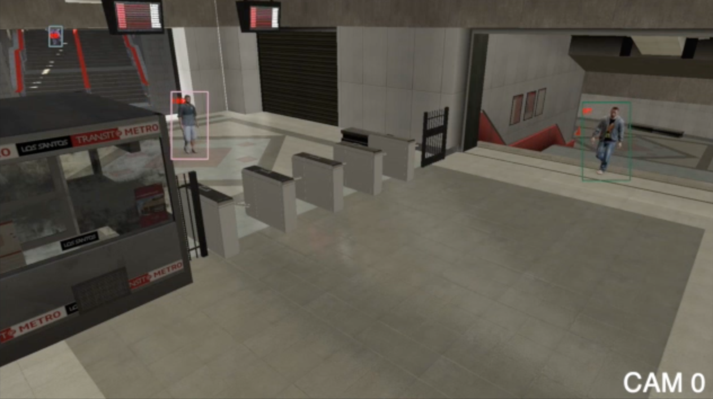
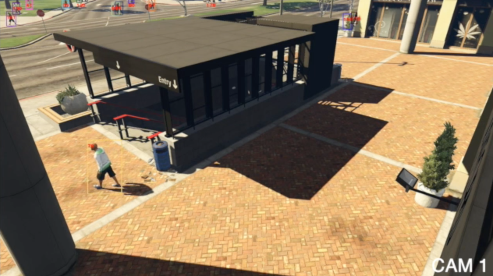
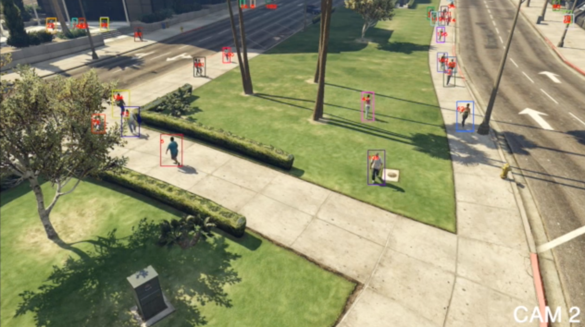
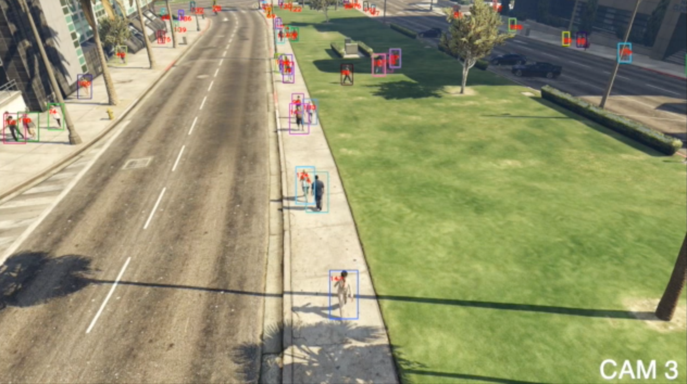
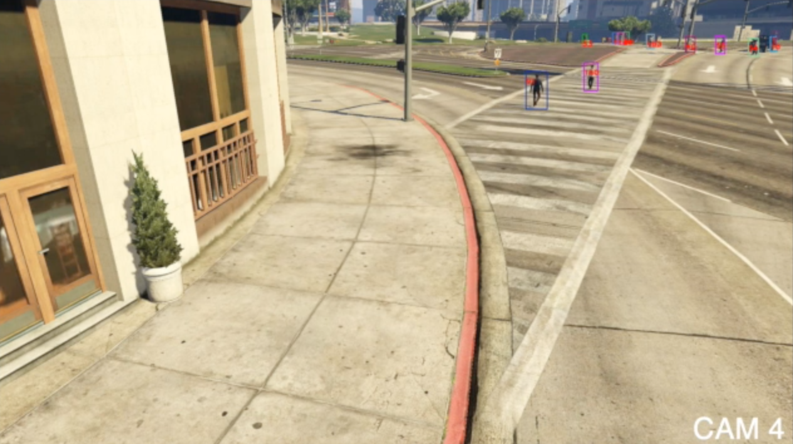
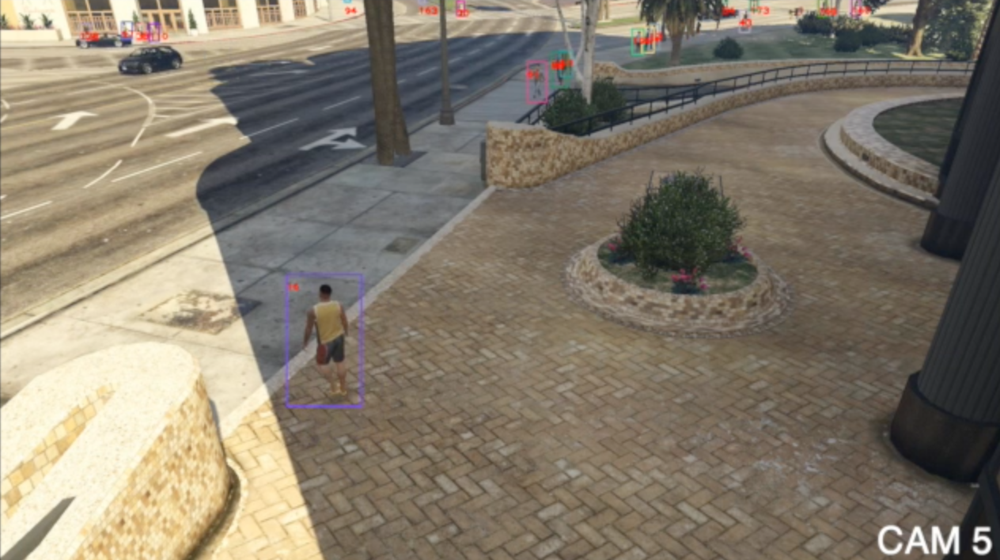

[English](./README.md) | 简体中文

# MTMCT
本项目包含了一个有效的多目标多摄像头追踪(MTMCT)解决方案的设计与代码实现。以下为解决方案的逻辑流程：


## 追踪表现
### 基于6x2分钟 [MTA](https://github.com/schuar-iosb/mta-dataset) 数据集的训练以及测试结果，以及与 [FairMOT](https://github.com/ifzhang/FairMOT) 和 [wda_tracker](https://github.com/koehlp/wda_tracker) 的对比：
<table>
    <thead>
        <tr>
            <th rowspan=2>Method</th>
            <th colspan=5>Single-Camera</th>
            <th colspan=5>Multi-Camera</th>
        </tr>
        <tr>
            <th>MOTA</th>
            <th>IDF1</th>
            <th>IDs</th>
            <th>MT</th>
            <th>ML</th>
            <th>MOTA</th>
            <th>IDF1</th>
            <th>IDs</th>
            <th>MT</th>
            <th>ML</th>
        </tr>
    </thead>
    <tbody>
        <tr>
            <td>WDA</td>
            <td>58.2</td>
            <td>37.3</td>
            <td>534.2</td>
            <td>16.8%</td>
            <td>17.2</td>
            <td>46.6</td>
            <td>19.8</td>
            <td>563.8</td>
            <td>6.5%</td>
            <td>7.0%</td>
        </tr>
        <tr>
            <td>FairMOT</td>
            <td>64.1</td>
            <td><strong>48.0</strong></td>
            <td>588.2</td>
            <td>34.7%</td>
            <td>7.8%</td>
            <td>N/A</td>
            <td>N/A</td>
            <td>N/A</td>
            <td>N/A</td>
            <td>N/A</td>
        </tr>
        <tr>
            <td>Ours</td>
            <td><strong>70.8</strong></td>
            <td>47.8</td>
            <td><strong>470.2</strong></td>
            <td><strong>40.5%</strong></td>
            <td><strong>5.6%</strong></td>
            <td><strong>65.6</strong></td>
            <td><strong>31.5</strong></td>
            <td><strong>494.5</strong></td>
            <td><strong>31.2%</strong></td>
            <td><strong>1.1%</strong></td>
        </tr>
    </tbody>
</table>

### 基于 [MTA](https://github.com/schuar-iosb/mta-dataset) 数据集的多摄像头追踪成果展示
     

点击这里查看动图展示：[动图示例](./demo_gifs.md)

更多完整展示视频请前往：[https://youtu.be/lS9YvbrhOdo](https://youtu.be/lS9YvbrhOdo)

## 项目安装
```shell
conda create -n mtmct python=3.7.7 -y
conda activate mtmct
pip install -r requirements.txt
```
安装 [FairMOT](https://github.com/ifzhang/FairMOT) 的依赖:
```shell
cd trackers/fair
conda install pytorch==1.7.0 torchvision==0.8.0 cudatoolkit=10.2 -c pytorch
pip install cython
pip install -r requirements.txt
cd DCNv2
./make.sh
conda install -c conda-forge ffmpeg
```

## 下载数据
前往 [https://github.com/schuar-iosb/mta-dataset](https://github.com/schuar-iosb/mta-dataset) 下载MTA数据集。或者使用其他符合相同格式的数据。

## 配置
修改`tracker_configs`和`clustering_configs`目录下的config文件来进行定制化配置。新建一个`work_dirs`目录并参照 [FairMOT](https://github.com/ifzhang/FairMOT) 以及 [wda_tracker](https://github.com/koehlp/wda_tracker) 查看更多文档。
配置示例：在`configs/tracker_configs/fair_high_30e`文件中修改data -> source -> base_folder为要使用的数据集的路径。

## 追踪
使用一键运行脚本来进行单摄像头以及多摄像头追踪任务：
```shell
sh start.sh fair_high_30e
```

修改`tracker_configs`和`clustering_configs`目录下的配置文件来进行定制。详细文档请参考 [FairMOT](https://github.com/ifzhang/FairMOT) 和 [wda_tracker](https://github.com/koehlp/wda_tracker)

## 致谢
本项目大量借鉴了 [FairMOT](https://github.com/ifzhang/FairMOT), [wda_tracker](https://github.com/koehlp/wda_tracker) 的代码。所使用的数据集为[MTA](https://github.com/schuar-iosb/mta-dataset)

## Copyright

Ruizhe Zhang is the author of this repository and the corresponding report, the copyright belongs to Wireless System Research Group (WiSeR), McMaster University.