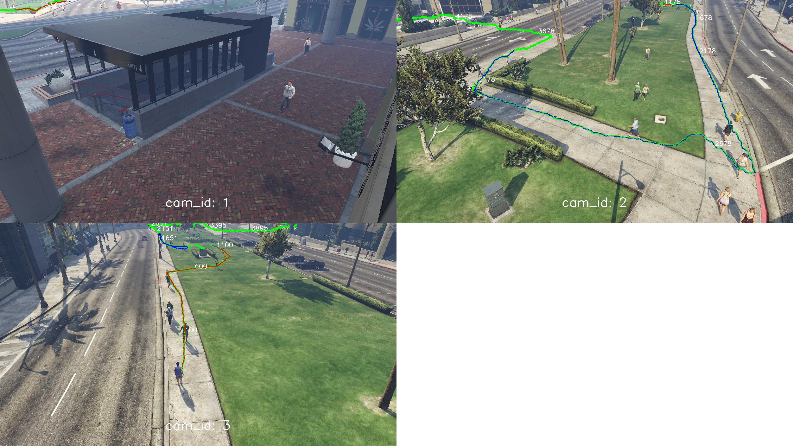

# WDA tracker

The WDA (weighted distance aggregation) tracker is an offline multi camera tracking approach.

It is published as part of `The MTA Dataset for Multi Target Multi Camera Pedestrian Tracking by Weighted Distance Aggregation`
(https://github.com/schuar-iosb/mta-dataset). 


This repository is structured in **two parts**:  

 The **first part** can be used to create single camera tracks 
from an input video. Startable via `run_tracker.py`.

The **second part** can be used to cluster single camera tracks
to obtain multi camera tracks with subsequent evaluation. Startable via `run_multi_cam_clustering.py`.


## Getting started


**Setting up an artefacts folder**  
Download work_dirs.zip (https://drive.google.com/uc?export=download&id=1SMlrtuGsgZ-DMZlIlUThgEpXQI9MOWrL) and unzip it in your base repository folder or create a symlink e.g. 
`ln -s /media/philipp/philippkoehl_ssd/work_dirs work_dirs`. 
It contains one or two re-id and detector models.
Furthermore output result files will be stored in this folder.

**Install python requirements**

Create a new conda environment:

```shell script
conda create -n wda python=3.7.7 -y
```
Activate the conda environment:
```shell script
conda activate wda
```
Install all needed python packages into the environment:
```shell script
pip install -r requirements.txt
```

Go into `detectors/mmdetection`

and build mmdetection (https://github.com/open-mmlab/mmdetection/blob/master/docs/install.md)

```shell script
pip install -r requirements/build.txt
pip install "git+https://github.com/open-mmlab/cocoapi.git#subdirectory=pycocotools"
pip install -v -e .  # or "python setup.py develop"
```
 

**Download the MTA Dataset**

Go to https://github.com/schuar-iosb/mta-dataset 
and follow the instructions to obtain the MTA Dataset. It is also possible to use 
the smaller extracted version MTA ext short at first. Unzip the dataset somewhere.

**Configure the single camera tracker**

E.g. in `configs/tracker_configs/frcnn50_new_abd_test.py` and `configs/tracker_configs/frcnn50_new_abd_train.py` 
set the data -> source -> base_folder to your MTA dataset location.

E.g. for the test set:
```python

...
"data" : {
        "selection_interval" : [0,10000],

        "source" : {
            "base_folder" : "/media/philipp/philippkoehl_ssd/MTA_ext_short/test",
            "cam_ids" : [0,1,2,3,4,5]
        }
    },
...
```

**Run the single camera tracking**

Run the single camera tracking to generate single camera tracks.

For the train set:

```python
python run_tracker.py --config configs/tracker_configs/frcnn50_new_abd_train.py
```

And for the test set:

```python

python run_tracker.py --config configs/tracker_configs/frcnn50_new_abd_test.py

```


**Configure the multi camera clustering**

Adjust the following paths of the single camera tracker results in the multi camera clustering config.

E.g. in `configs/clustering_configs/mta_es_abd_non_clean.py`

```python
...
"work_dirs" : "/media/philipp/philippkoehl_ssd/work_dirs"
,"train_track_results_folder" : "/home/philipp/Documents/repos/wda_tracker/work_dirs/tracker/config_runs/frcnn50_new_abd_train/tracker_results"
,"test_track_results_folder" : "/home/philipp/Documents/repos/wda_tracker/work_dirs/tracker/config_runs/frcnn50_new_abd_test/tracker_results"
,"train_dataset_folder" : "/media/philipp/philippkoehl_ssd/MTA_ext_short/train"
,"test_dataset_folder" : "/media/philipp/philippkoehl_ssd/MTA_ext_short/test"
...
```


**Run the multi camera clustering**

Run the following command to start the clustering of single camera tracks which
have been specified in the config file. As a result multi camera tracks will be output  and 
a subsequent evaluation using several tracking metrics will be performed.

```python
python run_multi_cam_clustering.py \
    --config configs/clustering_configs/mta_es_abd_non_clean.py
```

Some files for caching and results will be created in the `clustering/config_runs/mta_es_abd_non_clean`
folder. If you change some code it might be necessary that you delete some of these files.

```python
log.txt                        #Contains some log info
cam_homographies               #Contains calculated homographies between cameras                         
multicam_clustering_results    #Contains the multi camera clustering tracks
multicam_distances_and_indices #Contains calculated distances between single camera tracks 
multi_cam_evaluation           #Contains multi camera evaluation results
velocity_stats                 #Contains the average velocity of all persons 
overlapping_area_hulls         #Contains the calculated overlapping areas between all cameras 
person_id_tracks               #Contains pickled person id to tracks dictionary 
pickled_appearance_features    #Contains the pickled appearance feature for all frames
single_cam_evaluation          #Contains the single camera tracks

```


## Other contained scripts

There are also some scripts in the utilities folder e.g. to visualize multi camera tracks:



## Tracking results


- Config files: `frcnn50_new_abd_test.py, frcnn50_new_abd_train.py ,mta_es_abd_non_clean.py`
    - Person detection: Faster R-CNN ResNet 50 
    - Person re-identification: ABD-NET ResNet 50
    - DeepSort Tracker
    - All distances with the weights in `mta_es_abd_non_clean.py`
- Dataset
    - MTA ext short

Results:

| IDF1 | IDP  | IDR  | Rcll | Prcn | GT  | MT  | PT | ML | FP    | FN     | IDs  | FM   | MOTA | MOTP | 
|------|------|------|------|------|-----|-----|----|----|-------|--------|------|------|------|------| 
| 0.40 | 0.44 | 0.37 | 0.83 | 0.98 | 188 | 123 | 64 | 1  | 14723 | 124852 | 1846 | 7140 | 0.80 | 0.18 | 


## Development info

If you use pycharm for development, it is neccessary to add the following
folders as source root. This will add these paths to the python path.
```python
['feature_extractors/reid_strong_baseline'
                      ,'feature_extractors/ABD_Net'
                        ,'detectors/mmdetection'
                       ,'evaluation/py_motmetrics']
```


## Contained repositories

This repository contains a person detector called mmdetection
 (https://github.com/open-mmlab/mmdetection).
 
 
It also contains two person re-identification approaches strong reid baseline (https://github.com/michuanhaohao/reid-strong-baseline) and
ABD-Net (https://github.com/TAMU-VITA/ABD-Net). 
 
For multi person single camera tracking it contains DeepSort from (https://github.com/ZQPei/deep_sort_pytorch) 
which is originally from (https://github.com/nwojke/deep_sort).

The IOU-Tracker (https://github.com/bochinski/iou-tracker) is also contained but not integrated into the system.

Parts of  (https://github.com/ZwEin27/Hierarchical-Clustering) are used for clustering.

For evaluation the py-motmetrics is contained (https://github.com/cheind/py-motmetrics).

An approach for getting distinct colors is used:

(https://github.com/taketwo/glasbey).

Some scripts from the JTA-Dataset (https://github.com/fabbrimatteo/JTA-Dataset) are also contained.

## Citation

If you use it, please cite our work.
The affiliated paper was published at the CVPR 2020 VUHCS Workshop (https://vuhcs.github.io/)

```latex
@InProceedings{Kohl_2020_CVPR_Workshops,
    author = {Kohl, Philipp and Specker, Andreas and Schumann, Arne and Beyerer, Jurgen},
    title = {The MTA Dataset for Multi-Target Multi-Camera Pedestrian Tracking by Weighted Distance Aggregation},
    booktitle = {The IEEE/CVF Conference on Computer Vision and Pattern Recognition (CVPR) Workshops},
    month = {June},
    year = {2020}
}
```
